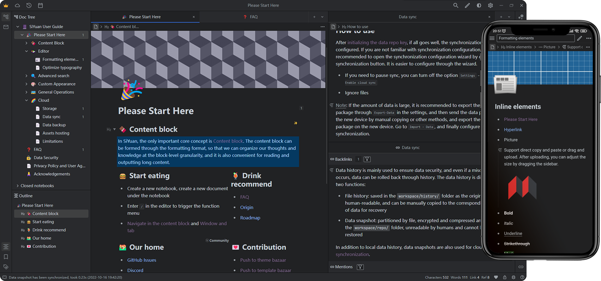

<p align="center">

<br>
Refactor your thinking
<br><br>
<a title="Build Status" target="_blank" href="https://github.com/siyuan-note/siyuan/actions/workflows/ci.yml"></a>
<a title="Releases" target="_blank" href="https://github.com/siyuan-note/siyuan/releases"></a>
<a title="Downloads" target="_blank" href="https://github.com/siyuan-note/siyuan/releases"></a>
<br>
<a title="Docker Pulls" target="_blank" href="https://hub.docker.com/r/b3log/siyuan"></a>
<a title="Docker Image Size" target="_blank" href="https://hub.docker.com/r/b3log/siyuan"></a>
<a title="Hits" target="_blank" href="https://github.com/siyuan-note/siyuan"></a>
<br>
<a title="AGPLv3" target="_blank" href="https://www.gnu.org/licenses/agpl-3.0.txt"></a>
<a title="Code Size" target="_blank" href="https://github.com/siyuan-note/siyuan"></a>
<a title="GitHub Pull Requests" target="_blank" href="https://github.com/siyuan-note/siyuan/pulls"></a>
<br>
<a title="GitHub Commits" target="_blank" href="https://github.com/siyuan-note/siyuan/commits/master"></a>
<a title="Last Commit" target="_blank" href="https://github.com/siyuan-note/siyuan/commits/master"></a>
<br><br>
<a title="Twitter" target="_blank" href="https://twitter.com/b3logos"></a>
<br><br>
<a href="https://www.producthunt.com/posts/siyuan?utm_source=badge-featured&utm_medium=badge&utm_souce=badge-siyuan" target="_blank"></a>
</p>

<p align="center">
<a href="README_zh_CN.md">中文</a>
</p>

## 💡 Introduction

SiYuan is a privacy-first personal knowledge management system, support fine-grained block-level reference and Markdown
WYSIWYG.

Welcome to [SiYuan English Discussion Forum](https://liuyun.io) to learn more.



## 🔮 Features

Most features are free, even for commercial use.

* Content block
  * Block-level reference and two-way links
  * Custom attributes
  * SQL query embed
  * Protocol `siyuan://`
* Editor
  * Block-style
  * Markdown WYSIWYG
  * List outline
  * Block zoom-in
  * Block horizontal layout
  * Million-word large document editing
  * Mathematical formulas, charts, flowcharts, Gantt charts, timing charts, staffs, etc.
  * Web clipping
  * PDF Annotation link
* Export
  * Block ref and embed
  * Standard Markdown with assets
  * PDF, Word and HTML
  * Copy to WeChat MP, Zhihu and Yuque
* Database
  * Table view
* Spaced repetition
* Multi-tab, drag and drop to split screen
* Template snippet
* JavaScript/CSS snippet
* Android/iOS APP
* Docker deployment
* [API](https://github.com/siyuan-note/siyuan/blob/master/API.md)
* Community marketplace

Some features are only available to paid members, for more details please refer to [Pricing](https://b3log.org/siyuan/en/pricing.html).

## 🏗️ Architecture design and open source ecosystem


* [bazzar](https://github.com/siyuan-note/bazaar): Community marketplace
* [dejavu](https://github.com/siyuan-note/dejavu): Data repo
* [riff](https://github.com/siyuan-note/riff): Spaced repetition system
* [petal](https://github.com/siyuan-note/petal): Plugin API
* [chrome](https://github.com/siyuan-note/siyuan-chrome): Chrome extension
* [lute](https://github.com/88250/lute): A structured editor engine that supports Go and JavaScript
* [ios](https://github.com/siyuan-note/siyuan-ios): iOS APP
* [android](https://github.com/siyuan-note/siyuan-android): Android APP

## 🌟 Star History

[](https://star-history.com/#siyuan-note/siyuan&Date)

## 🗺️ Roadmap

* [SiYuan development plan and progress](https://github.com/orgs/siyuan-note/projects/1)
* [SiYuan changelog](CHANGELOG.md)

## 🚀 Download Setup

It is recommended to give priority to installing through the application market on the desktop and mobile, so that you can upgrade the version with one click in the future.

### App Market

* [App Store](https://apps.apple.com/us/app/siyuan/id1583226508)
* [Google Play](https://play.google.com/store/apps/details?id=org.b3log.siyuan)
* [Microsoft Store](https://www.microsoft.com/store/apps/9P7HPMXP73K4)

### Docker Hosting

<details>
<summary>Docker Deployment</summary>

#### Overview

The easiest way to serve SiYuan on a server is to deploy it through Docker.

* Image name `b3log/siyuan`
* [Image URL](https://hub.docker.com/r/b3log/siyuan)

#### File structure

The overall program is located under `/opt/siyuan/`, which is basically the structure under the resources folder of the Electron installation package:

* appearance: icon, theme, languages
* guide: user guide document
* stage: interface and static resources
* kernel: kernel program

#### Entrypoint

The entry point is set when building the Docker image: `ENTRYPOINT ["/opt/siyuan/kernel" ]`, use `docker run b3log/siyuan` with parameters to start:

* `--workspace` specifies the workspace folder path, mounted to the container via `-v` on the host

More parameters can refer to `--help`. The following is an example of a startup command:

```
docker run -v workspace_dir_host:workspace_dir_container -p 6806:6806 b3log/siyuan --workspace=workspace_dir_container --accessAuthCode=xxx
```

* `workspace_dir_host`: the workspace folder path on the host
* `workspace_dir_container`: The path of the workspace folder in the container, which is the same as specified in `--workspace`
* `accessAuthCode`: Access authorization code, please **be sure to modify**, otherwise anyone can read and write your data

To simplify, it is recommended to configure the workspace folder path to be consistent on the host and container, such as: `workspace_dir_host` and `workspace_dir_container` are configured as `/siyuan/workspace`, the corresponding startup commands is:

```
docker run -v /siyuan/workspace:/siyuan/workspace -p 6806:6806 -u 1000:1000 b3log/siyuan --workspace=/siyuan/workspace/ --accessAuthCode=xxx
```

#### User permissions

In the image, the normal user `siyuan` (uid 1000/gid 1000) created by default is used to start the kernel process. Therefore, when the host creates a workspace folder, please pay attention to setting the user group of the folder:  `chown -R 1000:1000 /siyuan/workspace`. The parameter `-u 1000:1000` is required when starting the container.

#### Hidden port

Use NGINX reverse proxy to hide port 6806, please note:

* Configure WebSocket reverse proxy `/ws`

#### Note

* Be sure to confirm the correctness of the mounted volume, otherwise the data will be lost after the container is deleted
* Do not use URL rewriting for redirection, otherwise there may be problems with authentication, it is recommended to configure a reverse proxy

#### Limitations

* Does not support desktop and mobile application connections, only supports use on browsers
* Export to PDF, HTML and Word formats is not supported
* Import Markdown file is not supported

</details>

### Installation Package

* [B3log](https://b3log.org/siyuan/en/download.html)
* [GitHub](https://github.com/siyuan-note/siyuan/releases)

### Insider Preview

We release insider preview before major updates, please visit [https://github.com/siyuan-note/insider](https://github.com/siyuan-note/insider).

## 🏘️ Community

* [English Discussion Forum](https://liuyun.io)
* [User community summary](https://liuyun.io/article/1687779743723)
* [Awesome SiYuan](https://github.com/siyuan-note/awesome)

## 🛠️ Development Guide

See [Development Guide](https://github.com/siyuan-note/siyuan/blob/master/.github/CONTRIBUTING.md).

## ❓ FAQ

### How does SiYuan store data?

The data is saved in the workspace folder, in the workspace data folder:

* `assets` is used to save all inserted assets
* `emojis` is used to save emoji images
* `snippets` is used to save code snippets
* `storage` is used to save query conditions, layouts and flashcards, etc.
* `templates` is used to save template snippets
* `widgets` is used to save widgets
* `plugins` is used to save plugins
* `public` is used to save public data
* The rest of the folders are the notebook folders created by the user, files with the suffix of `.sy` in the notebook folder are used to save the document data, and the data format is JSON

### Does it support data synchronization through a third-party sync disk?

Data synchronization through third-party synchronization disks is not supported, otherwise data may be corrupted.

Although it does not support third-party sync disks, it supports connect with third-party cloud storage (Member's privileges).

In addition, you can also consider manually exporting and importing data to achieve data synchronization:

* Desktop: <kbd>Settings</kbd> - <kbd>Export</kbd> - <kbd>Export Data</kbd> / <kbd>Import Data</kbd>
* Mobile: <kbd>Right column</kbd> - <kbd>About</kbd> - <kbd>Export Data</kbd> / <kbd>Import Data</kbd>

### Is SiYuan open source?

SiYuan is completely open source, and contributions are welcome:

* [User Interface and Kernel](https://github.com/siyuan-note/siyuan)
* [Android](https://github.com/siyuan-note/siyuan-android)
* [iOS](https://github.com/siyuan-note/siyuan-ios)
* [Chrome Clipping Extension](https://github.com/siyuan-note/siyuan-chrome)

For more details, please refer to [Development Guide](https://github.com/siyuan-note/siyuan/blob/master/.github/CONTRIBUTING.md).

### How to upgrade to a new version?

* If installed via app store, please update via app store
* If it is installed through the installation package on the desktop, you can open the option of <kbd>Settings</kbd> - <kbd>About</kbd> - <kbd>Automatically download update installation package</kbd>, so that SiYuan will automatically download The latest version of the installation package and prompts to install
* If it is installed by manual installation package, please download the installation package again to install

You can <kbd>Check update</kbd> in <kbd>Settings</kbd> - <kbd>About</kbd> - <kbd>Current Version</kbd>, or pay attention to [Official website](https://b3log.org/siyuan/) or [GitHub Releases](https://github.com/siyuan-note/siyuan/releases) to get the new version.

### Is there any note for deleting docs?

After deletion, the doc will not appear in the operating system's recycle bin, but will be deleted directly. When deleted, SiYuan will generate data history.

### How can I just wrap and not start a new paragraph?

Please use <kbd>Shift+Enter</kbd>.

### What if some blocks (such as paragraph blocks in list items) cannot find the block icon?

The first sub-block under the list item is the block icon omitted. You can move the cursor into this block and trigger its block menu with <kbd>Ctrl+/</kbd> .

### How to share notes?

* Share document to Liandi
* Export and import `.sy.zip` package
* Via network hosting
* Export and import Markdown
* <kbd>Export Preview</kbd> to copy to third-party online services

### What should I do if the data repo key is lost?

* If the data repo key is correctly initialized on multiple devices before, the key is the same on all devices and can be set in <kbd>Settings</kbd> - <kbd>About</kbd> - <kbd>Data repo key</kbd> - <kbd>Copy key string</kbd> retrieve
* If it has not been configured correctly before (for example, the keys on multiple devices are inconsistent) or all devices are unavailable and the key string cannot be obtained, you can reset the key by following the steps below:

  1. Manually back up the data, you can use <kbd>Export Data</kbd> or directly copy the <kbd>workspace/data/</kbd> folder on the file system
  2. <kbd>Settings</kbd> - <kbd>About</kbd> - <kbd>Data rep key</kbd> - <kbd>Reset data repo</kbd>
  3. Reinitialize the data repo key. After initializing the key on one device, other devices import the key
  4. The cloud uses the new synchronization directory, the old synchronization directory is no longer available and can be deleted
  5. The existing cloud snapshots are no longer available and can be deleted

### Do I need to pay for it?

Most features are free, even for commercial use.

Member's privileges can only be used after payment, please refer to [Pricing](https://b3log.org/siyuan/en/pricing.html).

## 🙏 Acknowledgement

The birth of SiYuan is inseparable from many open source projects and contributors, please refer to the project source code kernel/go.mod, app/package.json and project homepage.

The growth of SiYuan is inseparable from user feedback and promotion, thank you for everyone's help to SiYuan ❤️

### Contributors

Welcome to join us and contribute code to SiYuan together.

<a href="https://github.com/siyuan-note/siyuan/graphs/contributors">
   
</a>
