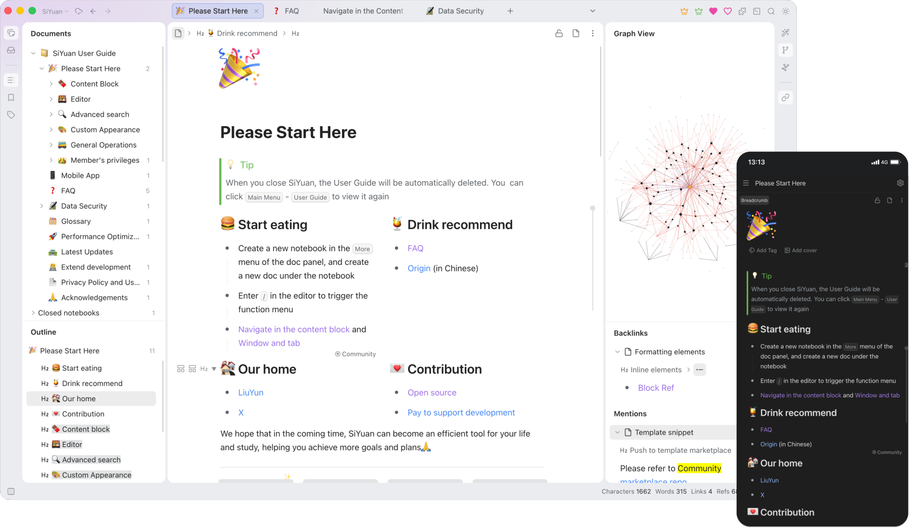
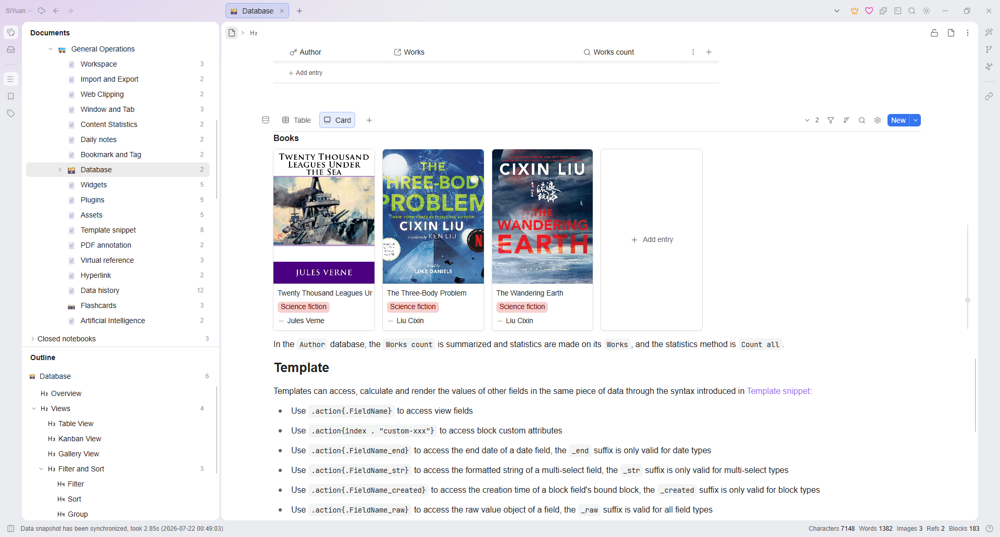
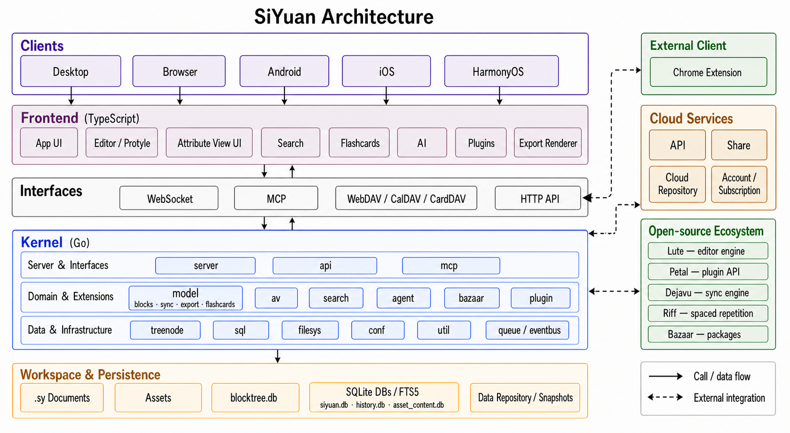

<p align="center">

<br>
<em>From thought to insight, with agents</em>
<br><br>
<a title="Build Status" target="_blank" href="https://github.com/siyuan-note/siyuan/actions/workflows/cd.yml"></a>
<a title="Releases" target="_blank" href="https://github.com/siyuan-note/siyuan/releases"></a>
<a title="Downloads" target="_blank" href="https://github.com/siyuan-note/siyuan/releases"></a>
<br>
<a title="Docker Pulls" target="_blank" href="https://hub.docker.com/r/b3log/siyuan"></a>
<a title="Docker Image Size" target="_blank" href="https://hub.docker.com/r/b3log/siyuan"></a>
<a title="Hits" target="_blank" href="https://github.com/siyuan-note/siyuan"></a>
<br>
<a title="AGPLv3" target="_blank" href="https://www.gnu.org/licenses/agpl-3.0.txt"></a>
<a title="Code Size" target="_blank" href="https://github.com/siyuan-note/siyuan"></a>
<a title="GitHub Pull Requests" target="_blank" href="https://github.com/siyuan-note/siyuan/pulls"></a>
<br>
<a title="GitHub Commits" target="_blank" href="https://github.com/siyuan-note/siyuan/commits/master"></a>
<a title="Last Commit" target="_blank" href="https://github.com/siyuan-note/siyuan/commits/master"></a>
<br><br>
<a title="X" target="_blank" href="https://x.com/b3logos"></a>
<br><br>
<a href="https://trendshift.io/repositories/3949" target="_blank"></a>
</p>

<p align="center">
<b>English</b>
| <a href="README.zh-CN.md">中文</a>
| <a href="README.ja.md">日本語</a>
| <a href="README.tr.md">Türkçe</a>
</p>

---

## Table of Contents

- [💡 Introduction](#-introduction)
- [🔮 Features](#-features)
- [🏗️ Architecture and Ecosystem](#-architecture-and-ecosystem)
- [🗺️ Roadmap](#️-roadmap)
- [🚀 Download Setup](#-download-setup)
  - [App Market](#app-market)
  - [Installation Package](#installation-package)
  - [Package Manager](#package-manager)
  - [Docker Hosting](#docker-hosting)
  - [Unraid Hosting](#unraid-hosting)
  - [TrueNAS Hosting](#truenas-hosting)
  - [Test Channels](#test-channels)
- [⌨️ Command-line Interface](#-command-line-interface)
- [🏘️ Community](#️-community)
- [🛠️ Development Guide](#️-development-guide)
- [❓ FAQ](#-faq)
  - [How does SiYuan store data?](#how-does-siyuan-store-data)
  - [Does it support data synchronization through a third-party sync disk?](#does-it-support-data-synchronization-through-a-third-party-sync-disk)
  - [Is SiYuan open source?](#is-siyuan-open-source)
  - [How to upgrade to a new version?](#how-to-upgrade-to-a-new-version)
  - [What if some blocks (such as paragraph blocks in list items) cannot find the block icon?](#what-if-some-blocks-such-as-paragraph-blocks-in-list-items-cannot-find-the-block-icon)
  - [What should I do if the data repo key is lost?](#what-should-i-do-if-the-data-repo-key-is-lost)
  - [Do I need to pay for it?](#do-i-need-to-pay-for-it)
- [🙏 Acknowledgement](#-acknowledgement)
  - [Contributors](#contributors)

---

## 💡 Introduction

SiYuan is a privacy-first personal knowledge management system, supporting fine-grained block-level reference and Markdown
WYSIWYG.





To learn more, read the [online user guide](https://siyuan-en.b3log.org/) or join the [SiYuan English Discussion Forum](https://liuyun.io).

## 🔮 Features

Most features are free, even for commercial use.

- Content block
  - Block-level reference and two-way links
  - Custom attributes
  - SQL query embed
  - Protocol `siyuan://`
- Editor
  - Block-style
  - Markdown WYSIWYG
  - List outline
  - Block zoom-in
  - Million-word large document editing
  - Mathematical formulas, charts, flowcharts, Gantt charts, timing charts, staves, etc.
  - Web clipping
  - PDF Annotation link
- Export
  - Block ref and embed
  - Standard Markdown with assets
  - PDF, Word and HTML
  - Copy to WeChat MP, Zhihu and Yuque
- Database
  - Table view
- Flashcard spaced repetition
- AI writing and Q/A chat via OpenAI API
- Tesseract OCR 
- Multi-tab, drag and drop to split screen
- Template snippet
- JavaScript/CSS snippet
- Android/iOS/HarmonyOS App
- Docker deployment
- [API](https://github.com/siyuan-note/siyuan/blob/master/docs/API.md)
- Community marketplace

Some features are only available to paid members, for more details please refer to [Pricing](https://b3log.org/siyuan/en/pricing.html).

## 🏗️ Architecture and Ecosystem



| Project                                                  | Description           | Forks                                                                           | Stars                                                                                | 
|----------------------------------------------------------|-----------------------|---------------------------------------------------------------------------------|--------------------------------------------------------------------------------------|
| [lute](https://github.com/88250/lute)                    | Editor engine         |                  |                  |
| [chrome](https://github.com/siyuan-note/siyuan-chrome)   | Chrome/Edge extension |   |   |
| [bazaar](https://github.com/siyuan-note/bazaar)          | Community marketplace |          |          |
| [dejavu](https://github.com/siyuan-note/dejavu)          | Data repo             |          |          |
| [petal](https://github.com/siyuan-note/petal)            | Plugin API            |           |           |
| [android](https://github.com/siyuan-note/siyuan-android) | Android App           |  |  |
| [ios](https://github.com/siyuan-note/siyuan-ios)         | iOS App               |      |      |
| [harmony](https://github.com/siyuan-note/siyuan-harmony) | HarmonyOS App         |  |  |
| [riff](https://github.com/siyuan-note/riff)              | Spaced repetition     |            |            |

## 🗺️ Roadmap

- [SiYuan development plan and progress](https://github.com/orgs/siyuan-note/projects/1)
- [SiYuan changelog](CHANGELOG.md)

## 🚀 Download Setup

It is recommended to give priority to installing through the application market on desktop and mobile, so that you can upgrade the version with one click in the future.

### App Market

Mobile:

- [App Store](https://apps.apple.com/us/app/siyuan/id1583226508)
- [Google Play](https://play.google.com/store/apps/details?id=org.b3log.siyuan)
- [F-Droid](https://f-droid.org/packages/org.b3log.siyuan)

Desktop:

- [Microsoft Store](https://apps.microsoft.com/detail/9p7hpmxp73k4)

### Installation Package

- [B3log](https://b3log.org/siyuan/en/download.html)
- [GitHub](https://github.com/siyuan-note/siyuan/releases)

### Package Manager

#### `siyuan`

[](https://repology.org/project/siyuan/versions)

#### `siyuan-note`

[](https://repology.org/project/siyuan-note/versions)

### Docker Hosting

<details>
<summary>Docker Deployment</summary>

#### Overview

The easiest way to serve SiYuan on a server is to deploy it through Docker.

- Image name `b3log/siyuan`
- [Image URL](https://hub.docker.com/r/b3log/siyuan)

#### File structure

The overall program is located under `/opt/siyuan/`, which is basically the structure under the resources folder of the Electron installation package:

- appearance: icon, theme, languages
- guide: user guide document
- stage: interface and static resources
- kernel: kernel program

#### Entrypoint

The entry point is set when building the Docker image: `ENTRYPOINT ["/opt/siyuan/entrypoint.sh"]`. This script allows changing the `PUID` and `PGID` of the user that will run inside the container. This is especially relevant to solve permission issues when mounting directories from the host. The `PUID` (User ID) and `PGID` (Group ID) can be passed as environment variables, making it easier to ensure correct permissions when accessing host-mounted directories.

Use the following parameters when running the container with `docker run b3log/siyuan`:

> **Note:** Since v3.7.0, the `serve` subcommand must be passed explicitly (e.g. `docker run b3log/siyuan serve --workspace=...`). Run `docker run --rm b3log/siyuan serve --help` to see all serving options.

- `--workspace`: Specifies the workspace folder path, mounted to the container via `-v` on the host
- `--accessAuthCode`: Specifies the lock screen password

More parameters can be found using `--help`. Here’s an example of a startup command with the new environment variables:

```bash
docker run -d \
  -v workspace_dir_host:workspace_dir_container \
  -p 6806:6806 \
  -e PUID=1001 -e PGID=1002 \
  b3log/siyuan \
  serve \
  --workspace=workspace_dir_container \
  --accessAuthCode=xxx
```

- `PUID`: Custom user ID (optional, defaults to `1000` if not provided)
- `PGID`: Custom group ID (optional, defaults to `1000` if not provided)
- `workspace_dir_host`: The workspace folder path on the host
- `workspace_dir_container`: The path of the workspace folder in the container, as specified in `--workspace`
  - Alternatively, it's possible to set the path via the `SIYUAN_WORKSPACE_PATH` env variable. The commandline will always have the priority, if both are set
- `accessAuthCode`: Lock screen password (please **be sure to modify**, otherwise anyone can access your data)
  - Alternatively, it's possible to set the lock screen password via the `SIYUAN_ACCESS_AUTH_CODE` env variable. The commandline will always have the priority, if both are set
  - To disable the lock screen password set the env variable `SIYUAN_ACCESS_AUTH_CODE_BYPASS=true`
- OIDC can replace the lock screen password as the required Docker access authentication. Set `SIYUAN_OIDC_ENABLED=true`, `SIYUAN_OIDC_PROVIDER` (`custom`, `google`, `microsoft`, or `github`), `SIYUAN_OIDC_CLIENT_ID`, and the provider-specific values below. GitHub uses its OAuth 2.0 user API adapter; the other providers use OpenID Connect discovery and ID Token validation. An invalid enabled configuration stops Docker startup when no lock screen password is available
  - `SIYUAN_OIDC_ISSUER_URL`: Issuer URL required by the `custom` and `microsoft` providers; Microsoft must use a tenant-specific issuer such as `https://login.microsoftonline.com/<tenant-id>/v2.0`
  - `SIYUAN_OIDC_CLIENT_SECRET`: Optional client secret for OpenID Connect providers; required by the GitHub OAuth adapter. Every authorization-code flow also uses PKCE
  - `SIYUAN_OIDC_SCOPES`: Comma- or space-separated scopes; `openid` is always included
  - `SIYUAN_OIDC_REDIRECT_URL`: Public HTTPS callback URL ending in `/api/system/oidc/callback`, required for remote browser access
  - `SIYUAN_OIDC_ALLOW_ALL`: Explicitly grant SiYuan administrator access to every identity authenticated by the provider
  - `SIYUAN_OIDC_CLAIM_RULES`: JSON array of claim rules used when allow-all is disabled, for example `[{"claim":"email","operator":"equals","values":["user@example.com"]},{"claim":"email_verified","operator":"equals","values":["true"]}]`; values within a rule use OR, while rules use AND
  - Native mobile apps use the fixed callback URI `siyuan:/oidc-callback`; register it exactly as written. Mobile configuration verification uses this callback before saving. Custom providers, Microsoft, and GitHub can be used only when their application registration accepts this callback URI. Google does not accept this private-use URI for its Android client type, so Google login is limited to browser and desktop flows
- `SIYUAN_LANG`: Interface language (optional, defaults to `en` if unset in Docker). Accepts BCP 47 tags like `zh-CN`/`zh-TW`/`en`/`ja`/`pt-BR`; legacy underscore values like `zh_CN`/`en_US` are also accepted for backward compatibility. Omit it if you want the language chosen in **Settings** to persist across restarts; if set, it is applied on every startup and overrides the saved setting
  - Alternatively, use the `--lang` command-line parameter. If both are set, the command-line takes priority

To simplify things, it is recommended to configure the workspace folder path to be consistent on the host and container, such as having both `workspace_dir_host` and `workspace_dir_container` configured as `/siyuan/workspace`. The corresponding startup command would be:

```bash
docker run -d \
  -v /siyuan/workspace:/siyuan/workspace \
  -p 6806:6806 \
  -e PUID=1001 -e PGID=1002 \
  b3log/siyuan \
  serve \
  --workspace=/siyuan/workspace/ \
  --accessAuthCode=xxx
```

#### Docker Compose

For users running SiYuan with Docker Compose, the environment variables `PUID` and `PGID` can be passed to customize the user and group IDs. Here's an example of a Docker Compose configuration:

```yaml
version: "3.9"
services:
  main:
    image: b3log/siyuan
    command: ['serve', '--workspace=/siyuan/workspace/', '--accessAuthCode=${AuthCode}']
    ports:
      - 6806:6806
    volumes:
      - /siyuan/workspace:/siyuan/workspace
    restart: unless-stopped
    environment:
      - TZ=${YOUR_TIME_ZONE}    # A list of time zone identifiers can be found at https://en.wikipedia.org/wiki/List_of_tz_database_time_zones
      - PUID=${YOUR_USER_PUID}  # Customize user ID
      - PGID=${YOUR_USER_PGID}  # Customize group ID
```

In this setup:

- `PUID` and `PGID` are set dynamically and passed to the container
- If these variables are not provided, the default `1000` will be used

By specifying `PUID` and `PGID` in the environment, you avoid the need to explicitly set the `user` directive (`user: '1000:1000'`) in the compose file. The container will dynamically adjust the user and group based on these environment variables at startup.

#### User Permissions

In the image, the `entrypoint.sh` script ensures the creation of the `siyuan` user and group with the specified `PUID` and `PGID`. Therefore, when the host creates a workspace folder, pay attention to setting the user and group ownership of the folder to match the `PUID` and `PGID` you plan to use. For example:

```bash
chown -R 1001:1002 /siyuan/workspace
```

If you use custom `PUID` and `PGID` values, the entrypoint script will ensure that the correct user and group are created inside the container, and ownership of mounted volumes will be adjusted accordingly. There’s no need to manually pass `-u` in `docker run` or `docker-compose` as the environment variables will handle the customization.

#### Hidden port

Use an NGINX reverse proxy to hide port 6806. Please note:

- Configure the WebSocket reverse proxy for `/ws`

#### Note

- Be sure to confirm the correctness of the mounted volume, otherwise the data will be lost after the container is deleted
- Do not use URL rewriting for redirection, otherwise there may be problems with authentication, it is recommended to configure a reverse proxy
- If you encounter permission issues, verify that the `PUID` and `PGID` environment variables match the ownership of the mounted directories on your host system

#### Limitations

- Does not support desktop and mobile application connections, only supports use on browsers
- Export to PDF, HTML and Word formats is not supported
- Import Markdown file is not supported

</details>

### Unraid Hosting

<details>
<summary>Unraid Deployment</summary>

Note: First run `chown -R 1000:1000 /mnt/user/appdata/siyuan` in the terminal

Template reference:

```
Web UI: 6806
Container Port: 6806
Container Path: /home/siyuan
Host path: /mnt/user/appdata/siyuan
PUID: 1000
PGID: 1000
Publish parameters: serve --accessAuthCode=******(Lock screen password)
```

</details>

### TrueNAS Hosting

<details>
<summary>TrueNAS Deployment</summary>

Note: First, run the commands below in the TrueNAS Shell. Please update `Pool_1/Apps_Data/siyuan` to match your dataset path.

```shell
zfs create Pool_1/Apps_Data/siyuan
chown -R 1001:1002 /mnt/Pool_1/Apps_Data/siyuan
chmod 755 /mnt/Pool_1/Apps_Data/siyuan
```

Navigate to Apps - DiscoverApps - More Options (on top right, besides Custom App) - Install via YAML

Template reference:

```yaml
services:
  siyuan:
    image: b3log/siyuan
    container_name: siyuan
    command: ['serve', '--workspace=/siyuan/workspace/', '--accessAuthCode=2222']
    ports:
      - 6806:6806
    volumes:
      - /mnt/Pool_1/Apps_Data/siyuan:/siyuan/workspace  # Adjust to your dataset path 
    restart: unless-stopped
    environment:
      - TZ=America/New_York  # Replace with your timezone if needed
      - PUID=1001
      - PGID=1002
```

</details>

### Test Channels

Select Beta or Alpha in `Settings - About - Update channel` to receive prereleases. Beta includes stable, RC, and Beta releases; Alpha includes all releases. Test channels require access to GitHub.

## ⌨️ Command-line Interface

The built-in CLI provides direct access to workspace data — no running server required.

### Quick Start

```bash
# List all notebooks
siyuan notebook list -w ~/SiYuan

# Full-text search with JSON output
siyuan search "keyword" -w ~/SiYuan -f json

# Search inside asset files (PDF/Word/Excel/txt etc.)
siyuan search "phrase" --asset -w ~/SiYuan
siyuan search "phrase" --asset --ext pdf --ext docx -w ~/SiYuan

# Export a document as Markdown
siyuan export md --id <block-id> -w ~/SiYuan
```

### Available Commands

| Category | Commands |
|----------|----------|
| Notebooks & Documents | `notebook`, `document`, `dailynote` — CRUD and daily notes |
| Content | `block`, `attr`, `outline` — block read/write, attributes, outline |
| Metadata | `tag`, `bookmark`, `template` — tags, bookmarks, template snippets |
| Queries | `search`, `sql` — full-text, semantic, asset-content, and SQL queries |
| References | `ref` — backlinks and mentions |
| Import/Export | `export`, `import`, `inbox` — Markdown, HTML, preview, Word, .sy.zip, Data, cloud inbox |
| Data Management | `repo`, `history`, `sync` — snapshots, versions, cloud sync |
| Utilities | `asset`, `file` — resources and file system |
| Database | `database` — attribute view management |
| Server | `serve` — start the kernel HTTP server |
| Workspace & System | `workspace`, `system` — list, inspect, system info |

Run `siyuan --help` for the full command tree. Use `-f json` (default is `-f table`) for script-friendly output. Most mutating commands also support `--dry-run` to preview changes without applying them.

### Installation

The CLI binary is `<install-dir>/resources/kernel/SiYuan-Kernel`, invoked via the `siyuan` command.

- **Windows**: the installer automatically adds the kernel directory to `PATH`, so `siyuan` works out of the box. The Microsoft Store edition runs in an MSIX sandbox and cannot modify `PATH`; deploy a `siyuan.cmd` shim once (survives Store updates):
  ```powershell
  # Microsoft Store edition only — run once in PowerShell
  $shimDir = "$env:LOCALAPPDATA\Microsoft\WindowsApps"   # already in PATH by default
  @(
      '@echo off'
      'setlocal'
      'set "ROOT="'
      'for /f "delims=" %%i in (''powershell -NoProfile -Command "(Get-AppxPackage *SiYuan*).InstallLocation"'') do set "ROOT=%%i"'
      'if not defined ROOT goto :noshim'
      '"%ROOT%\app\resources\kernel\SiYuan-Kernel.exe" %*'
      'exit /b %ERRORLEVEL%'
      ':noshim'
      '1>&2 echo siyuan: Microsoft Store edition not found'
      'exit /b 1'
  ) | Set-Content "$shimDir\siyuan.cmd"
  ```
  To remove on uninstall: `Remove-Item "$env:LOCALAPPDATA\Microsoft\WindowsApps\siyuan.cmd"`.
- **macOS**: create a symlink after installing:
  ```bash
  ln -s /Applications/SiYuan.app/Contents/Resources/kernel/SiYuan-Kernel /usr/local/bin/siyuan
  ```
- **Linux**: create a symlink after installing:
  ```bash
  ln -s <install-dir>/resources/kernel/SiYuan-Kernel /usr/local/bin/siyuan
  ```

## 🏘️ Community

- [English Discussion Forum](https://liuyun.io)
- [User community summary](https://liuyun.io/article/1687779743723)
- [Awesome SiYuan](https://github.com/siyuan-note/awesome)

## 🛠️ Development Guide

See [Development Guide](https://github.com/siyuan-note/siyuan/blob/master/.github/CONTRIBUTING.md).

## ❓ FAQ

### How does SiYuan store data?

The data is saved in the workspace data folder:

- `assets` is used to save all inserted assets
- `emojis` is used to save emoji images
- `snippets` is used to save code snippets
- `storage` is used to save query conditions, layouts and flashcards, etc.
- `templates` is used to save template snippets
- `widgets` is used to save widgets
- `plugins` is used to save plugins
- `public` is used to save public data
- The rest of the folders are the notebook folders created by the user, files with the suffix of `.sy` in the notebook folder are used to save the document data, and the data format is JSON

### Does it support data synchronization through a third-party sync disk?

Data synchronization through third-party synchronization disks is not supported, otherwise data may be corrupted.

Although it does not support third-party sync disks, it supports connecting with third-party cloud storage (Members' privileges).

### Is SiYuan open source?

SiYuan is completely open source, and contributions are welcome:

- [User Interface and Kernel](https://github.com/siyuan-note/siyuan)
- [Android](https://github.com/siyuan-note/siyuan-android)
- [iOS](https://github.com/siyuan-note/siyuan-ios)
- [HarmonyOS](https://github.com/siyuan-note/siyuan-harmony)
- [Chrome Clipping Extension](https://github.com/siyuan-note/siyuan-chrome)

For more details, please refer to [Development Guide](https://github.com/siyuan-note/siyuan/blob/master/.github/CONTRIBUTING.md).

### How to upgrade to a new version?

- If installed via app store, please update via app store
- If it is installed with the desktop installation package on Windows or macOS, you can enable the option of <kbd>Settings</kbd> - <kbd>About</kbd> - <kbd>Automatically download update installation package</kbd>, so that SiYuan will automatically download the latest version of the installation package and prompt to install
- If it is installed by manual installation package, please download the installation package again to install

You can <kbd>Check update</kbd> in <kbd>Settings</kbd> - <kbd>About</kbd> - <kbd>Current Version</kbd>, or pay attention to [Official Download](https://b3log.org/siyuan/en/download.html) or [GitHub Releases](https://github.com/siyuan-note/siyuan/releases) to get the new version.

### What if some blocks (such as paragraph blocks in list items) cannot find the block icon?

The block icon is omitted for the first sub-block under the list item. You can move the cursor into this block and trigger its block menu with <kbd>Ctrl+/</kbd> .

### What should I do if the data repo key is lost?

- If the data repo key is correctly initialized on multiple devices previously, the key is the same on all devices and can be retrieved in <kbd>Settings</kbd> - <kbd>Account & Sync</kbd> - <kbd>Local Data Repo</kbd> - <kbd>Data repo key</kbd> - <kbd>Copy key string</kbd>
- If it has not been configured correctly before (for example, the keys on multiple devices are inconsistent) or all devices are unavailable and the key string cannot be obtained, you can reset the key by following the steps below:

  1. Manually back up the data, you can use <kbd>Export Data</kbd> or directly copy the <kbd>workspace/data/</kbd> folder on the file system
  2. <kbd>Settings</kbd> - <kbd>Account & Sync</kbd> - <kbd>Local Data Repo</kbd> - <kbd>Data repo key</kbd> - <kbd>Reset data repo</kbd>
  3. Reinitialize the data repo key. After initializing the key on one device, other devices import the key
  4. The cloud uses the new synchronization directory, the old synchronization directory is no longer available and can be deleted
  5. The existing cloud snapshots are no longer available and can be deleted

### Do I need to pay for it?

Most features are free, even for commercial use.

Member's privileges can only be used after payment, please refer to [Pricing](https://b3log.org/siyuan/en/pricing.html).

## 🙏 Acknowledgement

The birth of SiYuan is inseparable from many open source projects and contributors. Please refer to the project source code kernel/go.mod, app/package.json and project homepage.

The growth of SiYuan is inseparable from user feedback and promotion. Thank you, everyone, for your help with SiYuan ❤️

### Contributors

Welcome to join us and contribute code to SiYuan together.

<a href="https://github.com/siyuan-note/siyuan/graphs/contributors">
   
</a>


## 🌐 Web Resources & Aesthetic Symbols Index
- [SYM 2682](https://pink-bow-fonts-37.pages.dev/symbol/sym-2682/)
- [SYM 2764 FE0F](https://neon-futuristic-symbols-58.pages.dev/symbol/sym-2764-fe0f/)
- [SYM 1D47A](https://daintystar-font-studio-48.pages.dev/symbol/sym-1d47a/)
- [SYM 26E3](https://minimal-star-symbols-87.pages.dev/symbol/sym-26e3/)
- [SYM 2672](https://minimal-star-symbols-87.pages.dev/symbol/sym-2672/)
- [SYM 1D4A2](https://vintage-script-symbols-65.pages.dev/symbol/sym-1d4a2/)
- [SYM 26AC](https://neon-futuristic-symbols-58.pages.dev/symbol/sym-26ac/)
- [WHITE FLORETTE BLOSSOM](https://sleek-arrow-symbols-42.pages.dev/symbol/white-florette-blossom/)
- [SYM 2731](https://cyber-clan-tags-75.pages.dev/symbol/sym-2731/)
- [SYM 2614](https://sleek-bio-symbols-40.pages.dev/symbol/sym-2614/)
- [SYM 1D44C](https://pearl-heart-symbols-95.pages.dev/symbol/sym-1d44c/)
- [SYM 26D8](https://neon-futuristic-symbols-58.pages.dev/symbol/sym-26d8/)
- [SYM 1F635 200D 1F4AB](https://pearl-heart-symbols-95.pages.dev/symbol/sym-1f635-200d-1f4ab/)
- [SYM 1D447](https://pastel-moe-emoticons-55.pages.dev/symbol/sym-1d447/)
- [ARROWS LINES](https://gothic-bio-fonts-14.pages.dev/es/arrows-lines/)
- [SYM 1F635 200D 1F4AB](https://pastel-moe-emoticons-55.pages.dev/symbol/sym-1f635-200d-1f4ab/)
- [SYM 26F9](https://pastel-moe-emoticons-55.pages.dev/symbol/sym-26f9/)
- [SYM 1F97A](https://kawaii-kaomoji-hub-77.pages.dev/symbol/sym-1f97a/)
- [SYM 26C1](https://pastel-moe-emoticons-55.pages.dev/symbol/sym-26c1/)
- [SYM 1D400](https://pastel-moe-emoticons-55.pages.dev/symbol/sym-1d400/)
- [SYM 1F602](https://chibi-emoticon-lab-65.pages.dev/symbol/sym-1f602/)
- [SHADOWED WHITE STAR](https://occult-aesthetic-symbols-26.pages.dev/symbol/shadowed-white-star/)
- [GOTHIC OBSIDIAN SKULL CREST](https://chibi-emoticon-lab-65.pages.dev/symbol/gothic-obsidian-skull-crest/)
- [SYM 1D42E](https://gothic-bio-fonts-81.pages.dev/symbol/sym-1d42e/)
- [SYM 1F480](https://zen-unicode-hub-94.pages.dev/symbol/sym-1f480/)
- [SYM 2663](https://pastel-moe-emoticons-55.pages.dev/symbol/sym-2663/)
- [SYM 1F607](https://pastel-moe-emoticons-55.pages.dev/symbol/sym-1f607/)
- [SYM 26C6](https://kawaii-kaomoji-hub-77.pages.dev/symbol/sym-26c6/)
- [SYM 1F92D](https://pastel-moe-emoticons-55.pages.dev/symbol/sym-1f92d/)
- [SYM 26D9](https://pastel-moe-emoticons-55.pages.dev/symbol/sym-26d9/)
- [SIXTEEN POINTED STAR](https://kawaii-kaomoji-hub-80.pages.dev/symbol/sixteen-pointed-star/)
- [SYM 1D466](https://occult-aesthetic-symbols-26.pages.dev/symbol/sym-1d466/)
- [INSTAGRAM BIO](https://minimal-star-symbols-43.pages.dev/es/instagram-bio/)
- [ARROWS LINES](https://gothic-bio-fonts-81.pages.dev/es/arrows-lines/)
- [SYM 26EA](https://gothic-bio-fonts-81.pages.dev/symbol/sym-26ea/)
- [SYM 2629](https://pastel-moe-emoticons-55.pages.dev/symbol/sym-2629/)
- [LEFT WING CLAN FLARE](https://kawaii-kaomoji-hub-80.pages.dev/symbol/left-wing-clan-flare/)
- [SYM 1D448](https://alchemist-symbol-hub-29.pages.dev/symbol/sym-1d448/)
- [CURVED HEART BLOOMY](https://sleek-arrow-symbols-42.pages.dev/symbol/curved-heart-bloomy/)
- [SYM 1D496](https://minimal-star-symbols-91.pages.dev/symbol/sym-1d496/)
- [SYM 2613](https://anime-sparkle-text-81.pages.dev/symbol/sym-2613/)
- [CURVED HEART BLOOMY](https://kawaii-kaomoji-hub-80.pages.dev/symbol/curved-heart-bloomy/)
- [SYM 1D484](https://neon-matrix-symbols-94.pages.dev/symbol/sym-1d484/)
- [SYM 1F49E](https://pastel-moe-emoticons-55.pages.dev/symbol/sym-1f49e/)
- [SYM 267C](https://sleek-bio-symbols-40.pages.dev/symbol/sym-267c/)
- [TIKTOK CAPTIONS](https://anime-sparkle-text-81.pages.dev/pt/tiktok-captions/)
- [SYM 1FA77](https://pastel-moe-emoticons-55.pages.dev/symbol/sym-1fa77/)
- [SYM 1F61F](https://pastel-manga-symbols-57.pages.dev/symbol/sym-1f61f/)
- [ARROWS LINES](https://alchemist-symbol-hub-29.pages.dev/ja/arrows-lines/)
- [SYM 2747](https://pearl-heart-symbols-95.pages.dev/symbol/sym-2747/)
- [SYM 260E](https://gothic-bio-fonts-14.pages.dev/symbol/sym-260e/)
- [SYM 2655](https://minimal-star-symbols-43.pages.dev/symbol/sym-2655/)
- [WHITE SUN WITH RAYS](https://occult-aesthetic-symbols-26.pages.dev/symbol/white-sun-with-rays/)
- [RIGHT BLACK LENTICULAR BRACKET](https://pearl-heart-symbols-95.pages.dev/symbol/right-black-lenticular-bracket/)
- [SYM 2744](https://synthwave-text-vault-95.pages.dev/symbol/sym-2744/)
- [BORDERS DIVIDERS](https://sleek-arrow-symbols-42.pages.dev/vi/borders-dividers/)
- [TRENDING](https://sleek-arrow-symbols-42.pages.dev/ja/trending/)
- [SYM 2663](https://sleek-bio-symbols-40.pages.dev/symbol/sym-2663/)
- [SYM 2613](https://synthwave-text-vault-95.pages.dev/symbol/sym-2613/)
- [SIX POINTED BLACK STAR](https://sleek-bio-symbols-40.pages.dev/symbol/six-pointed-black-star/)
- [SYM 26FC](https://pearl-heart-symbols-95.pages.dev/symbol/sym-26fc/)
- [CRYING TEARS SAD KAOMOJI](https://minimal-star-symbols-91.pages.dev/symbol/crying-tears-sad-kaomoji/)
- [SYM 1D489](https://pastel-moe-emoticons-55.pages.dev/symbol/sym-1d489/)
- [SYM 26C9](https://coquette-aesthetic-symbols-84.pages.dev/symbol/sym-26c9/)
- [SYM 1D43F](https://baroque-font-vault-96.pages.dev/symbol/sym-1d43f/)
- [SYM 1F641](https://minimal-star-symbols-91.pages.dev/symbol/sym-1f641/)
- [SUPER SHY BLUSHING KAOMOJI](https://minimal-star-symbols-91.pages.dev/symbol/super-shy-blushing-kaomoji/)
- [SYM 1D48F](https://pearl-heart-symbols-95.pages.dev/symbol/sym-1d48f/)
- [SYM 268B](https://minimal-star-symbols-43.pages.dev/symbol/sym-268b/)
- [SYM 2733](https://sleek-arrow-symbols-42.pages.dev/symbol/sym-2733/)
- [SYM 1D441](https://pastel-manga-symbols-57.pages.dev/symbol/sym-1d441/)
- [SPRING TULIP BLOSSOM](https://gothic-bio-fonts-14.pages.dev/symbol/spring-tulip-blossom/)
- [SYM 2612](https://minimal-star-symbols-43.pages.dev/symbol/sym-2612/)
- [SYM 1D453](https://pearl-heart-symbols-95.pages.dev/symbol/sym-1d453/)
- [SYM 2613](https://vintage-scholar-text-15.pages.dev/symbol/sym-2613/)
- [ROTATED HEART BULLET](https://coquette-aesthetic-symbols-62.pages.dev/symbol/rotated-heart-bullet/)
- [SYM 26CA](https://pastel-manga-symbols-57.pages.dev/symbol/sym-26ca/)
- [SYM 1D489](https://alchemist-symbol-hub-29.pages.dev/symbol/sym-1d489/)
- [SYM 1F49D](https://synthwave-text-vault-95.pages.dev/symbol/sym-1f49d/)
- [SYM 26D1](https://pearl-heart-symbols-95.pages.dev/symbol/sym-26d1/)
- [SYM 1F60D](https://minimal-star-symbols-91.pages.dev/symbol/sym-1f60d/)
- [SYM 26D6](https://minimal-star-symbols-91.pages.dev/symbol/sym-26d6/)
- [SYM 1D47F](https://pastel-moe-emoticons-55.pages.dev/symbol/sym-1d47f/)
- [BRACKETS](https://pearl-heart-symbols-95.pages.dev/vi/brackets/)
- [SYM 1F609](https://neon-futuristic-symbols-58.pages.dev/symbol/sym-1f609/)
- [LATIN CROSS HEAVY](https://vintage-script-symbols-65.pages.dev/symbol/latin-cross-heavy/)
- [SYM 1F92A](https://vintage-script-symbols-65.pages.dev/symbol/sym-1f92a/)
- [SYM 26FE](https://pastel-moe-emoticons-55.pages.dev/symbol/sym-26fe/)
- [DAGGER CROSS SYMBOL](https://gothic-bio-fonts-81.pages.dev/symbol/dagger-cross-symbol/)
- [SYM 1F479](https://synthwave-text-vault-95.pages.dev/symbol/sym-1f479/)
- [SYM 1D414](https://minimal-star-symbols-91.pages.dev/symbol/sym-1d414/)
- [SYM 2721](https://sleek-arrow-symbols-42.pages.dev/symbol/sym-2721/)
- [SYM 1F608](https://coquette-aesthetic-symbols-84.pages.dev/symbol/sym-1f608/)
- [SYM 1F60A](https://vintage-script-symbols-65.pages.dev/symbol/sym-1f60a/)
- [SYM 2667](https://coquette-aesthetic-symbols-62.pages.dev/symbol/sym-2667/)
- [SYM 26DF](https://pearl-heart-symbols-95.pages.dev/symbol/sym-26df/)
- [SYM 26BC](https://vintage-angel-text-38.pages.dev/symbol/sym-26bc/)
- [SYM 1D485](https://sleek-bio-symbols-40.pages.dev/symbol/sym-1d485/)
- [SYM 1F92D](https://sleek-arrow-symbols-42.pages.dev/symbol/sym-1f92d/)
- [SYM 260F](https://sleek-arrow-symbols-42.pages.dev/symbol/sym-260f/)
- [SYM 1FAE4](https://coquette-aesthetic-symbols-62.pages.dev/symbol/sym-1fae4/)
- [SYM 1F625](https://ribbon-bow-unicode-18.pages.dev/symbol/sym-1f625/)
- [BRACKETS](https://baroque-font-vault-96.pages.dev/ru/brackets/)
- [SYM 1FAE0](https://minimal-star-symbols-43.pages.dev/symbol/sym-1fae0/)
- [SYM 1D48F](https://minimal-star-symbols-91.pages.dev/symbol/sym-1d48f/)
- [SYM 265C](https://vintage-scholar-text-15.pages.dev/symbol/sym-265c/)
- [SYM 1D43A](https://cyber-clan-tags-75.pages.dev/symbol/sym-1d43a/)
- [BRACKETS](https://coquette-aesthetic-symbols-84.pages.dev/es/brackets/)
- [SINGLE EIGHTH MUSICAL NOTE](https://glitch-mecha-kaomoji-69.pages.dev/symbol/single-eighth-musical-note/)
- [SYM 2741](https://sleek-arrow-symbols-42.pages.dev/symbol/sym-2741/)
- [SYM 1D429](https://gothic-bio-fonts-81.pages.dev/symbol/sym-1d429/)
- [SYM 262F](https://baroque-font-vault-96.pages.dev/symbol/sym-262f/)
- [HEARTS](https://vintage-angel-text-38.pages.dev/pt/hearts/)
- [SYM 2667](https://cyber-clan-tags-36.pages.dev/symbol/sym-2667/)
- [SYM 1D485](https://pearl-heart-symbols-95.pages.dev/symbol/sym-1d485/)
- [LEFT WHITE CORNER BRACKET](https://anime-sparkle-text-73.pages.dev/symbol/left-white-corner-bracket/)
- [SYM 2674](https://coquette-aesthetic-symbols-62.pages.dev/symbol/sym-2674/)
- [RU](https://vintage-script-symbols-65.pages.dev/ru/)
- [SYM 26F1](https://minimal-star-symbols-91.pages.dev/symbol/sym-26f1/)
- [RIGHTWARDS PAIRED HARPOON](https://pastel-moe-emoticons-55.pages.dev/symbol/rightwards-paired-harpoon/)
- [INSTAGRAM BIO](https://clean-aesthetic-fonts-33.pages.dev/ja/instagram-bio/)
- [SYM 1D41A](https://coquette-aesthetic-symbols-62.pages.dev/symbol/sym-1d41a/)
- [ROTATED FLORAL HEART](https://minimal-star-symbols-43.pages.dev/symbol/rotated-floral-heart/)
- [SYM 1F635](https://vintage-angel-text-38.pages.dev/symbol/sym-1f635/)
- [INSTAGRAM BIO](https://anime-sparkle-text-73.pages.dev/ru/instagram-bio/)
- [SYM 26FF](https://gothic-bio-fonts-81.pages.dev/symbol/sym-26ff/)
- [INSTAGRAM BIO](https://gothic-bio-fonts-14.pages.dev/ja/instagram-bio/)
- [FLORAL HEART VINE](https://occult-aesthetic-symbols-26.pages.dev/symbol/floral-heart-vine/)
- [SYM 1D440](https://kawaii-kaomoji-hub-80.pages.dev/symbol/sym-1d440/)
- [SYM 1D484](https://alchemist-symbol-hub-29.pages.dev/symbol/sym-1d484/)
